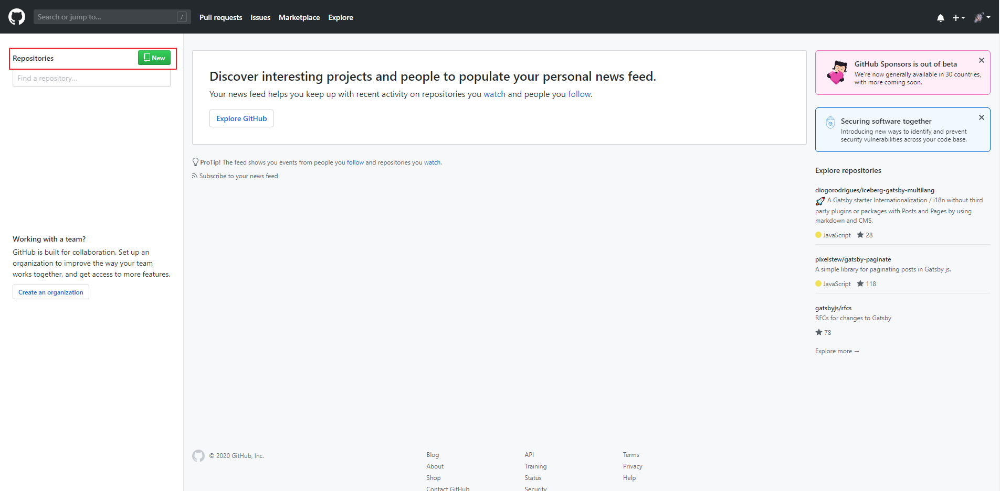
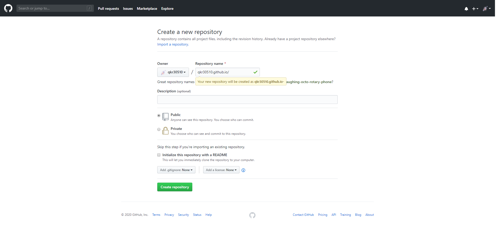
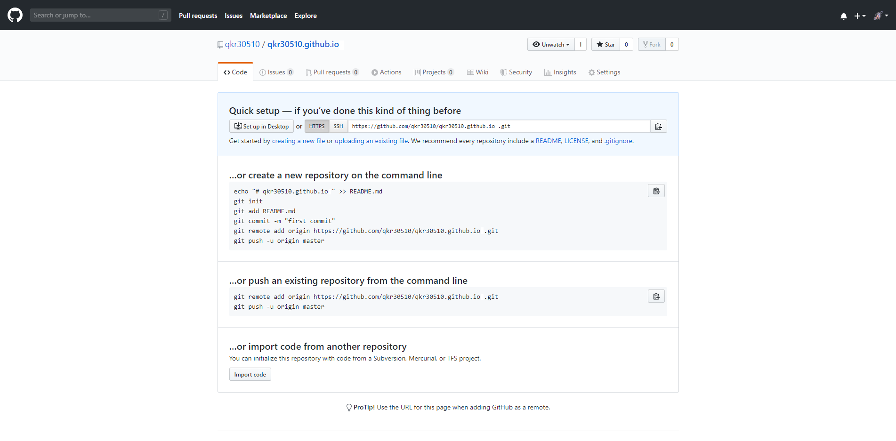

글을 쓰기에 앞서.. 난 이 블로그를 개설하는 데만 2주가 넘는 시간을 소요했다.ㅜㅜ
윈도우를 사용하는것도 크게 한 몫하였고, 내가 얼마나 기초가 없는지 나의 문제점은 무엇인지를 알게된 하나의 계기가 되었다. 
혹시라도 내 글을 보게 된 사람은 나와 같은 문제를 조속히 해결하여 블로그 쓰는 기쁨을 누리길 바란다!


## 개발 환경
* 윈도우 사용
* 에디터: vs코드 
* 개츠비 스타터: [한재엽님 개츠비](https://github.com/JaeYeopHan/gatsby-starter-bee/)

## 개츠비 스타터로 블로그 시작하기

1. 블로그가 담길 새로운 파일을 만들어 준다.

2. 터미널로 새로운 파일 위치로 들어가서 개츠비 cil을 만들어준다.
```
npm install -g gatsby-cli 
```

3. 설치가 끝나면 그 다음 아래 코드를 입력한다.
```
gatsby new my-blog-starter https://github.com/JaeYeopHan/gatsby-starter-bee 
```

4. 로컬에서 확인하기 
```
cd my-blog-starter
npm run develop
```

> 이 과정까지 완료한다면 초록색 success가 쭈우우욱 나오면서 local host:8080이 
나올텐데 그걸 클릭해서 접속하면 된다.    
my-blog-starter 폴더에서 content -> blog -> first.md 를 수정해보고 
local host를 확인해보자.
변경된 내역이 보일 것이다.

## 깃이랑 연결하기.

1.  [깃허브 가입 하기](https://github.com)

2. Repositories에서 new를 클릭


3. Repository name에 깃 아이디 + .github.io 로 적어주기 (깃 대표 블로그로 만들 경우. netlify로 진행할시에는 아무거나 적어도 상관없음.)


4. 창에 뜨는 대로 cmd에 입력하여(터미널엔 my-blog-starter 가 들어가 있어야한다.) 깃이랑 해당 폴더랑 연결해주기 
